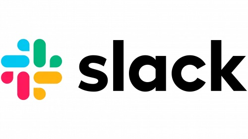

# SLACK Clone with REACT.JS!

Welcome to the SLACK Clone repository! This project aims to build a more efficient and user-friendly version of the popular messaging app SLACK using REACT.JS, along with REDUX for state management, Styled Components for beautiful, modular styling, and Firebase Hooks for real-time database interaction.



## Features
- Real-time messaging
- Channels and Direct Messages
- User Authentication

- And more!

## Technologies Used
- React.js
- Redux
- Styled Components
- Firebase (Authentication & Firestore)

## Prerequisites
You'll need the following installed on your machine:
- Node.js (v14.0 or above)
- npm (v6.0 or above)
- A Firebase Account (for database setup)

## Installation
Clone the repository:

```bash
git clone https://github.com/yourusername/slack-clone.git
